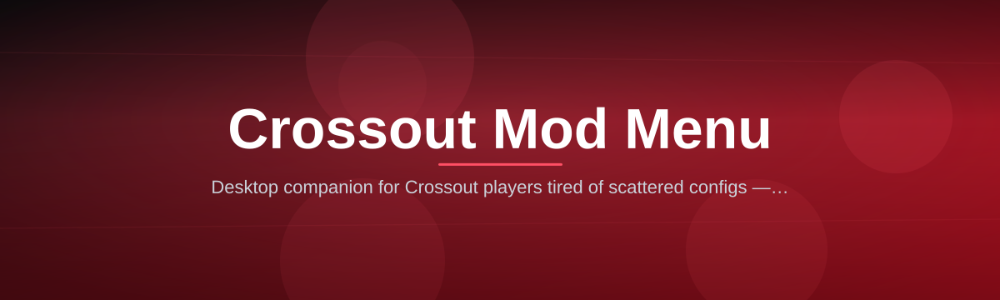

  
  
  

  

  
  
  

---

---

## 🧭 Overview

| Category | Details |
|---|---|
| Product | Crossout Mod Menu — client-side overlay & loadout toolkit |
| Target Game | Crossout (Targem Games / Gaijin Distribution) |
| Distribution | Landing page download → extract → run |
| Interface | In-game overlay, hotkey-driven, no game files modified |
| Update Cycle | Patched within 24–72h of Crossout client updates |
| Active Modules | 26 |

This repository hosts the release notes and documentation for **my-project**, a standalone `.exe` overlay built specifically around Crossout's garage, battle, and workshop systems. It injects a lightweight menu into your session so you can tweak visuals, unlock cosmetic previews, and manage combat overlays without touching the game's installation folder. Everything below covers what it does, how it compares to forum-thread alternatives, and how to get running in minutes.

---

## 📜 Table of Contents

- [🛠️ Quick Start](#️-quick-start)
- [📦 Installation](#-installation)
- [⚖️ Comparison](#️-comparison)
- [🧩 FAQ](#-faq)
- [🎮 Compatibility & Platform Support](#-compatibility--platform-support)
- [🧱 The Problem](#-the-problem)
- [⚙️ All Modules Status](#️-all-modules-status)
- [🐞 Known Issues](#-known-issues)
- [🧰 Troubleshooting Flow](#-troubleshooting-flow)
- [🎨 Key Features](#-key-features)
- [📋 Usage Guidelines](#-usage-guidelines)
- [💾 System Requirements](#-system-requirements)
- [📖 What is a Crossout Mod Menu?](#-what-is-a-crossout-mod-menu)

---

## 🛠️ Quick Start

1. 🧭 Visit the project landing page (link on this repo's release tab).
2. 📦 Download the packaged archive — no installer wrapper, no bundled junk.
3. 🗃️ Extract to any folder outside `Program Files` (avoids permission prompts).
4. 🎮 Launch Crossout first, then run the `.exe` as administrator.
5. ⌨️ Press the default hotkey (`Insert`) in-garage to open the overlay.

  

## 📦 Installation

**Step 1 — Grab the archive.** The landing page always serves the current build; older mirrors are deprecated automatically once a Crossout patch lands.

**Step 2 — Extract cleanly.** Use any archive tool. Do not run directly from inside the compressed file — Windows will silently block DLL-adjacent resources if you do.

**Step 3 — First launch.** Start Crossout, wait until you're in the garage screen, then start the `.exe`. The overlay attaches passively; it does not modify `.exe` or any client files on disk.

---

## ⚖️ Comparison

| Aspect | Forum-Thread Cheats | This Tool |
|---|---|---|
| Update turnaround | Days to weeks | 24–72 hours |
| Setup complexity | Manual config edits | One `.exe`, hotkey menu |
| Interface | Console/text based | In-game overlay UI |
| Module count | Varies, often unmaintained | 26 maintained modules |
| Anti-ban approach | None or outdated | Built-in spoofer module |
| Support channel | Scattered comment threads | Centralized changelog |
| Garage customization | Rarely included | Native decor/paint preview tools |

---

## 🧩 FAQ

Does this modify Crossout's installation files?

No. The overlay attaches at runtime and reads memory for display purposes only — your client files stay untouched, which keeps re-verification checks clean.

Will a Crossout client update break the menu?

Usually for a short window. The team tracks Gaijin's patch schedule and pushes a compatible build, typically within 24–72 hours of a live patch.

Can I use this on the Steam version of Crossout?

Yes, both the Steam client and the standalone Gaijin launcher build are supported identically since the overlay hooks the running process, not the launcher.

Do I need to disable Windows Defender?

Not required, but you may need to whitelist the extracted folder — unsigned overlay executables commonly trigger heuristic (not signature) flags.

Is there a Discord or support hub?

Support links and the changelog are linked from the landing page footer; join before your first launch to catch any pinned compatibility notes.

**Q: Does the menu work in ranked battles?**
A: Visual/ESP-type modules function everywhere; combat-adjacent modules are scoped to PvE/Workshop by design.

**Q: Can I run it windowed and fullscreen?**
A: Both. Borderless windowed gives the smoothest overlay rendering.

**Q: Does it require .NET or DirectX installs separately?**
A: No manual installs — dependencies are bundled inside the archive.

**Q: Is there a portable/no-admin mode?**
A: A limited-feature mode runs without elevation; full overlay injection needs admin rights once per session.

---

## 🎮 Compatibility & Platform Support

| Platform | Support | Notes |
|---|---|---|
| Windows 11 | ✅ Full | Primary build target |
| Windows 10 (64-bit) | ✅ Full | Fully tested across recent builds |
| Steam client (Crossout) | ✅ Full | Overlay attaches to process directly |
| Standalone Gaijin launcher | ✅ Full | No launcher-specific patching needed |
| Windows 8.1 | ⚠️ Partial | Menu loads, some overlay effects degrade |
| macOS / Linux (Wine/Proton) | ❌ Unsupported | Memory hooking behaves inconsistently |
| Console (PS/Xbox) | ❌ Not applicable | Overlay tools are PC-client only |

---

## 🧱 The Problem

- Grinding for garage decor, paint jobs, and workshop cosmetics takes dozens of hours per item.
- Default HUD gives almost no readable combat info during chaotic PvE swarms.
- Enemy positioning in fog/smoke situations is nearly impossible to judge with stock visuals.
- Switching builds mid-session means backing out to garage repeatedly — no quick-swap tooling exists natively.
- Clan tags, chat spam, and kill-feed clutter make spectating or streaming matches messy.
- Players fear account flags from poorly-maintained third-party tools that never patch after updates.
- There's no built-in way to preview unowned skins/decor before committing resources to them.

---

## ⚙️ All Modules Status

| Module | Status | Description |
|---|---|---|
| Overlay Core | ✅ Working | Ren

  

